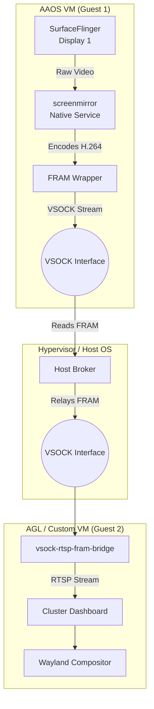

# aaos vsock streamer

This repository provides the complete source code and instructions to relay **custom framed H.264 video** from an **Android Automotive OS (AAOS)** instance to an **Automotive Grade Linux (AGL)** over **VSOCK**.

---

## Architecture

The solution uses a 3-tier architecture to efficiently pass video frames across VM boundaries using `vhost-vsock`.



### Flow Breakdown
1. **Data Flow**: 
   - `screenmirror` captures the UI from SurfaceFlinger on AAOS.
   - It hardware-encodes the frames into H.264 (Annex-B).
   - Each frame is prefixed with a custom 16-byte **FRAM** header.
   - The packet is written to a VSOCK file descriptor connected to the Host Broker.
   - The Host Broker reads from AAOS and relays the exact bytes to the Target VM over another VSOCK connection.
   - The `vsock-rtsp-fram-bridge` running in the Target VM reads the FRAM bytes, unpacks the H.264 NALUs, adds RTP headers, and serves them locally via RTSP.
2. **Control Flow**: 
   - The RTSP server inside the Target VM dynamically spawns GStreamer `appsrc` elements only when a client (like the Cluster Dashboard) connects.
   - Configuration (CSD/SPS/PPS) frames are cached in the bridge to ensure immediate decoding whenever a client joins the stream.

---

## Message Formatting (FRAM Protocol)

Data sent over the VSOCK connection uses a custom **FRAM protocol**. Every video frame (or configuration data) is prefixed with a 16-byte binary header followed immediately by the H.264 payload.

**16-Byte Header Layout:**
- **Bytes 0-3**: Payload Length (`uint32_t`)
- **Bytes 4-11**: Presentation Timestamp (PTS) in microseconds (`uint64_t`)
- **Bytes 12-15**: Flags bitmask (`uint32_t`)

**Supported Flags:**
- `0x01` (`FLAG_KEYFRAME`): Indicates the payload contains an IDR / Keyframe.
- `0x04` (`FLAG_EOS`): End of Stream signal.
- `0x08` (`FLAG_CONFIG`): Indicates the payload contains Codec Specific Data (CSD) like SPS/PPS.

*(Note: The bridge auto-detects endianness (Little-Endian / Big-Endian) based on the first few packets.)*

---

## Integration Guide

### 1. AAOS (Sender)

The `device` configurations are not included in this repository. You must integrate the `screenmirror` framework code into your own AAOS device tree.

**Step 1: Copy Source Code**
Copy the `AAOS/screenmirror` directory to `frameworks/av/cmds/screenmirror` in your AOSP/AAOS source tree.

**Step 2: Update SEPolicy**
Update your device's `BoardConfig.mk` (e.g., `device/<vendor>/<product>/BoardConfig.mk`) to include the sepolicy for the native service:
```make
# Include screenmirror policy from frameworks
BOARD_SEPOLICY_DIRS += \
    frameworks/av/cmds/screenmirror/sepolicy
```

**Step 3: Include Packages in Build**
Update your device's `device.mk` (or product makefile) to include the binaries:
```make
PRODUCT_PACKAGES += screenmirror \
                    screenmirror_test
```

**Step 4: Build AAOS**
```bash
source build/envsetup.sh
lunch <your_device_target>
m -j$(nproc)
```

### 2. Host Broker

The host broker runs on the hypervisor/host machine to route VSOCK traffic.

```bash
cd Host_broker/vsock_screenmirror_broker
mkdir build && cd build
cmake ..
cmake --build . -j
./host_broker
```

### 3. AGL VM (Receiver)

1. Add the `meta-render` layer from `AGL_Cluster/meta-render` to your Yocto build.
2. Enable the service in your `local.conf` (see `AGL_Cluster/local.conf.sample`).
3. Boot the AGL VM. The `vsock-mirror-bridge` daemon will automatically start on boot and listen on `rtsp://127.0.0.1:8554/test`.

---

## Decoupling AGL: Using a Custom VM

Because the architecture relies on standard VSOCK and a well-defined **FRAM** protocol, the AGL VM is **not strictly required**. You can easily replace the AGL target with any other Linux VM (e.g., Ubuntu, Yocto, Buildroot) to render the Dynamic Rear View Camera (DRC) or IVI stream.

**Steps to use another VM:**
1. **Enable VSOCK**: Ensure your new VM is launched with a VSOCK device (e.g., QEMU `-device vhost-vsock-pci,guest-cid=<CID>`).
2. **Reconfigure Broker**: Start the `host_broker` on the host machine and point it to your new VM's CID.
3. **Compile the Bridge**: Take the `vsock-rtsp-fram-bridge.c` code (located in `AGL_Cluster/meta-render/recipes-core/vsock-rtsp-fram-bridge/files/`) and compile it directly on your new Linux VM using `gcc` and `pkg-config` for GStreamer.
4. **Connect a Client**: The bridge will still expose the RTSP stream locally. You can use standard tools to view it:
   ```bash
   gst-launch-1.0 playbin uri=rtsp://127.0.0.1:8554/test
   ```
   Or write a custom Wayland/X11 application to ingest and display the RTSP stream exactly where you want it.
